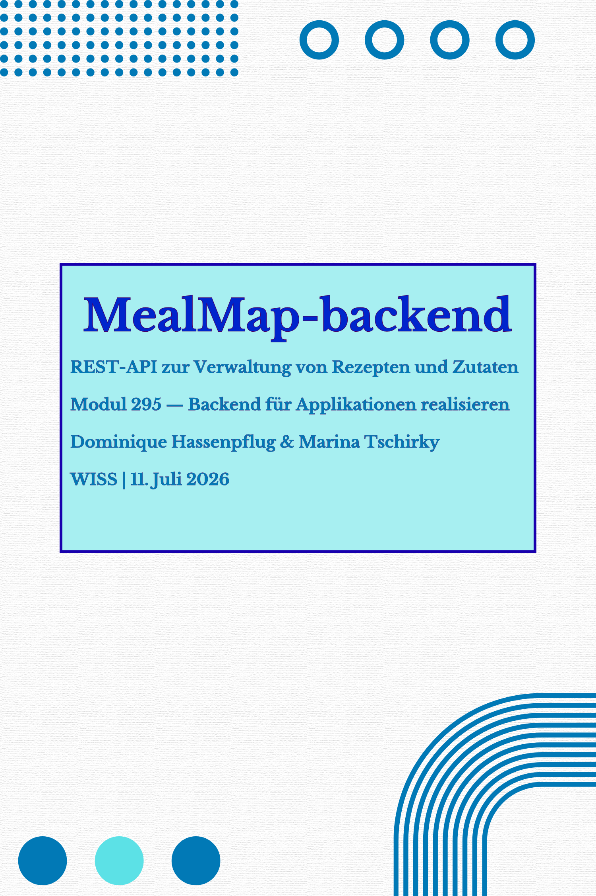

---

# mealmap-backend - Projektdokumentation

Modul 295 - Backend für Applikationen realisieren
Autoren: Dominique Hassenpflug, Marina Tschirky

---

## Inhaltsverzeichnis
1. [Projektidee](#1-projektidee)
2. [Anforderungskatalog — User Stories](#2-anforderungskatalog--user-stories)
3. [Klassendiagramm](#3-klassendiagramm)
4. [Testplan und Testdurchführung](#4-testplan-und-testdurchführung)
5. [Installationsanleitung](#5-installationsanleitung)
6. [Hilfestellungen und Quellen](#6-hilfestellungen-und-quellen)

---

## 1. Projektidee
Im Modul 294 haben wir mit **MealMap** eine Web-Applikation zum Entdecken von Rezepten aus aller Welt entwickelt. Nutzer
konnten Rezepte nach Kategorie durchsuchen, zu einer persönlichen Favoritenliste hinzufügen und mit Notiz sowie Bewertung versehen.
die Rezeptdaten stammten dabei von der externen API **TheMealDB**, die Favoriten wurden lokal über **json-server** gespeichert. 

Aufbauend auf dieser Idee entstand **nealmap-backend**: eine eigenssständige REST-API zur Verwaltung von Kochrezepten und deren
Zutaten, entwickelt mit **Spring Boot** und **PostgreSQL**. Statt wie im Frontend auf eine exterene API zuzugreifen, verwalten wir die Rezepte und 
Zutaten hier selbst in einer eigenen Datenbank. Nutzer können Rezepte anlegen, durchsuchen, im Detail ansehen, bearbeiten und 
löschen. Jedes Rezept besteht aus allgemeinen Angaben (Titel, Beschreibung, Kategorie, Zubereitung) sowie euber beliebigen Anzahl an Zutaten
mit Menge und Einheit.

Zielgruppe sind Personen, die ihre eigenen Rezepte strukturiert und durchsuchbar ablegen möchten. Für diese LB ist das backend bewusst als eigenständiges,
unabhängiges PRojekt umgesetzt, ohne technische Anbindung an TheMealDB oder das bestehende MealMap-Frontend.
---
## Anforderungskatalog - User Stories
### User Story 1: Rezept erstllen
**Als** Nutzer 
**moöchte ich** ein neues Rezept mit seinen Zutaten erfassen
**damit ich** meine eigenen Rezepte digital verwalten kann.

**Akzeptanzkriterien:**
- Rezept kann mit Titel, Beschreibung, Kategorie, Zubereitung und mindestens einer Zutat angelegt werden (CREATE)
- Fehlt ein Pflichtfeld oder ist die Zutatenliste leer, erscheint eine verständliche Fehlermeldung. (Validierung)
- Nach erfolgreichem Anlegen erhält das Rezept eine eindeutige ID.

**API-Ablauf:**
````
POST /api/recipes
````
**Beispiel-Request:**
```json
{
  "title": "Tomatensuppe",
  "description": "Einfache, cremige Tomatensuppe",
  "category": "Suppe",
  "instructions": "Tomaten anschwitzen, mit Bruehe aufkochen, pueriseren.",
  "ingredients": [
    { "name": "Tomaten", "amount": 1000, "unit": "g" },
    { "name": "Gemuesebruehe", "amount": 500, "unit": "ml" }
  ]
}
```
**Beispiel-Response (201 Created):**
```json
{
  "id": 7,
  "title": "Tomatensuppe",
  "description": "Einfache, cremige Tomatensuppe",
  "category": "Suppe",
  "instructions": "Tomaten anschwitzen, mit Bruehe aufkochen, pueriseren.",
  "ingredients": [
    { "id": 15, "name": "Tomaten", "amount": 1000, "unit": "g" },
    { "id": 16, "name": "Gemuesebruehe", "amount": 500, "unit": "ml" }
  ]
}
```
---
### User Story 2: Rezepte durchsuchen

**Als** Nutzer
**möchte ich** alle vorhandenen Rezepte abrufen
**damit ich** einen Überblick ueber meine Sammlung erhalte.

**Akzeptanzkriterien:**
- Alle Rezepte werden inklusive ihrer Zutaten in einer Liste
  angezeigt (READ)
- Sind keine Rezepte vorhanden, wird eine leere Liste angezeigt
  statt eines Fehlers

**API-Ablauf:**
```
GET /api/recipes
```

**Beispiel-Response (200 OK):**
```json
[
  {
    "id": 1,
    "title": "Blumenkohlcremesuppe",
    "description": "Klassische cremige Suppe aus Blumenkohl",
    "category": "Suppe",
    "instructions": "...",
    "ingredients": [
      { "id": 1, "name": "Butter", "amount": 30, "unit": "g" }
    ]
  }
]
```

---

### User Story 3: Rezeptdetails ansehen

**Als** Nutzer
**möchte ich** ein bestimmtes Rezept ueber seine ID abrufen
**damit ich** nur die Details eines Rezepts sehe, das mich
interessiert.

**Akzeptanzkriterien:**
- Bei gültiger ID werden alle Details inklusive Zutaten angezeigt
  (READ)
- Bei ungültiger ID erscheint eine verständliche Fehlermeldung
  (Rezept nicht gefunden)

**API-Ablauf:**
```
GET /api/recipes/{id}
```

**Beispiel-Response (200 OK):**
```json
{
  "id": 1,
  "title": "Blumenkohlcremesuppe",
  "description": "Klassische cremige Suppe aus Blumenkohl",
  "category": "Suppe",
  "instructions": "...",
  "ingredients": [
    { "id": 1, "name": "Butter", "amount": 30, "unit": "g" },
    { "id": 2, "name": "Zwiebeln, geschaelt", "amount": 80, "unit": "g" }
  ]
}
```

**Beispiel-Response bei Fehler (404 Not Found):**
```json
{
  "timestamp": "2026-07-04T18:30:00",
  "status": 404,
  "error": "Not Found",
  "message": "Recipe mit ID 99 wurde nicht gefunden"
}
```

---
### User Story 4: Rezept bearbeiten

**Als** Nutzer
**möchte ich** ein bestehendes Rezept bearbeiten
**damit ich** Fehler korrigieren oder Mengenangaben anpassen kann.

**Akzeptanzkriterien:**
- Titel, Beschreibung, Kategorie, Zubereitung und Zutatenliste
  koennen vollstaendig aktualisiert werden (UPDATE)
- Ungültige Eingaben (z. B. leerer Titel) werden mit einer
  Fehlermeldung abgelehnt (Validierung)
- Bei ungültiger ID erscheint eine verstädliche Fehlermeldung

**API-Ablauf:**
```
PUT /api/recipes/{id}
```

**Beispiel-Request:**
```json
{
  "title": "Tomatensuppe (verfeinert)",
  "description": "Cremige Tomatensuppe mit einem Hauch Basilikum",
  "category": "Suppe",
  "instructions": "Tomaten anschwitzen, mit Bruehe aufkochen, pueriseren, mit Basilikum verfeinern.",
  "ingredients": [
    { "name": "Tomaten", "amount": 1000, "unit": "g" },
    { "name": "Gemuesebruehe", "amount": 500, "unit": "ml" },
    { "name": "Basilikum, frisch", "amount": 10, "unit": "g" }
  ]
}
```

**Beispiel-Response (200 OK):**
```json
{
  "id": 7,
  "title": "Tomatensuppe (verfeinert)",
  "description": "Cremige Tomatensuppe mit einem Hauch Basilikum",
  "category": "Suppe",
  "instructions": "Tomaten anschwitzen, mit Bruehe aufkochen, pueriseren, mit Basilikum verfeinern.",
  "ingredients": [
    { "id": 20, "name": "Tomaten", "amount": 1000, "unit": "g" },
    { "id": 21, "name": "Gemuesebruehe", "amount": 500, "unit": "ml" },
    { "id": 22, "name": "Basilikum, frisch", "amount": 10, "unit": "g" }
  ]
}
```

**Beispiel-Response bei Fehler (400 Bad Request):**
```json
{
  "timestamp": "2026-07-04T18:35:00",
  "status": 400,
  "error": "Validation Failed",
  "message": "title: Titel darf nicht leer sein"
}
```

---
### User Story 5: Rezept löschen

**Als** Nutzer
**möchte ich** ein nicht mehr benötigtes Rezept löschen
**damit** meine Sammlung übersichtlich und aktuell bleibt.

**Akzeptanzkriterien:**
- Rezept kann inklusive aller Zutaten gelöscht werden (DELETE)
- Bei ungültiger ID erscheint eine verständliche Fehlermeldung
- Nach dem Löschen ist das Rezept nicht mehr abrufbar

**API-Ablauf:**
```
DELETE /api/recipes/{id}
```

**Beispiel-Response:**
Status `204 No Content` (kein Body)

**Beispiel-Response bei Fehler (404 Not Found):**
```json
{
  "timestamp": "2026-07-04T18:31:00",
  "status": 404,
  "error": "Not Found",
  "message": "Recipe mit ID 99 wurde nicht gefunden"
}
```

---

## 3. Klassendiagramm

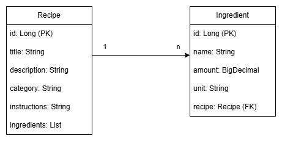

---
## 4. Testplan und Testdurchführung
### 4.1 Manuelle Tests (Insomnia)
Die manuellen Tests wurden mit Insomnia gegen die lokal laufende Anwendung('http://localhost:8080') bei aktiver PostgreSQL-Datenbank
(Docker, Port 5433) durchgeführt. Alle 5 Testfälle decken je einen zentralen CRUD-Endpoint ab ( 2x POST, 2x GET, 1x DELETE)
und prüfen den Erfolgsfall (Happy Path) sowie typische Fehlerfälle (Validierung, nicht vorhandene Ressource).

#### Testplan
| #  | Testfall                                  | Methode + URL            | Beispiel Body                                                                     | Erwartetes Ergebnis (Soll) |
|---|-------------------------------------------|--------------------------|-----------------------------------------------------------------------------------|---|
| 1 | Neues Rezept erfolgreich erstellen        | POST /api/recipes        | Gültiges Rezept mit Titel, Beschreibung, Kategorie, Zubereitung und mind. 1 Zutat | Status 201 Created, Response enthält das Rezept mit generierter ID |
| 2 | Rezept ohne Titel erstellen (Validierung) | POST /api/recipes | Rezept mit leerem `title` | Status 400 Bad Request, Fehlermeldung zu `title` |
| 3 | Alle Rezepte abrufen                      | GET /api/recipes | - | Status 200 OK, Liste aller Rezepte inkl. Zutaten|
| 4 | Rezept mit ungültiger ID abrufen          | GET /api/recipes/9999 | - | Status 404 Not Found, Fehlermeldung "Recipe mit ID 9999 wurde nicht gefunden" |
| 5 | Rezept löschen (inkl. Verifikation)       | DELETE /api/recipe/{id} | - | Status 204 No Content; anschliessendes GET auf dieselbe ID liefert 404 |

#### Testdurchführung
| # | Testfall | Erwartetes ERgebnis (Soll) | Tatsächliches Ergebnis (Ist) | Status | 
|---|---|---|---|---|
| 1 | Neues Rezept erfolgreich erstelln | 201 Created, Rezept mit ID | 201 Crated, Rezept mit ID 8 inkl beider Zutaten korrekt zurückgegeben | Bestanden |
| 2 | Rezept ohne Titel erstellen | 400 Bad Request, Fehlermeldung zu `title` | 400 Bad REquest, Validierungsfehler korrekt gemeldet | Bestanden |
| 3 | Alle REzepte abrufen | 200 OK. Liste aller REzepte | 200 OK. alle REzepte inkl. Zutaten zurückgegeben | Bestanden |
| 4 | Rezept mit ungültiger ID abrufen | 404 Not Found | 404 Not Found, korrekte Fehlermeldung | Bestanden | 
| 5 | Rezept löschen + Verifikation | 204 No Content, danach 404 bei GET | 204 No Content beim Löschen; anschliessend GET aus dieselbe ID lieferte 404 Not Found | Bestanden |

**Ergenbnis:** Alle 5 Testfälle wurden erfolgreich durchgeführt. Die Anwendung verhält sich in allen getesteten Fällen wie erwartet. 

#### Screenshots als Nachweis

**Testfall 1 — Neues Rezept erfolgreich erstellen (201 Created)**
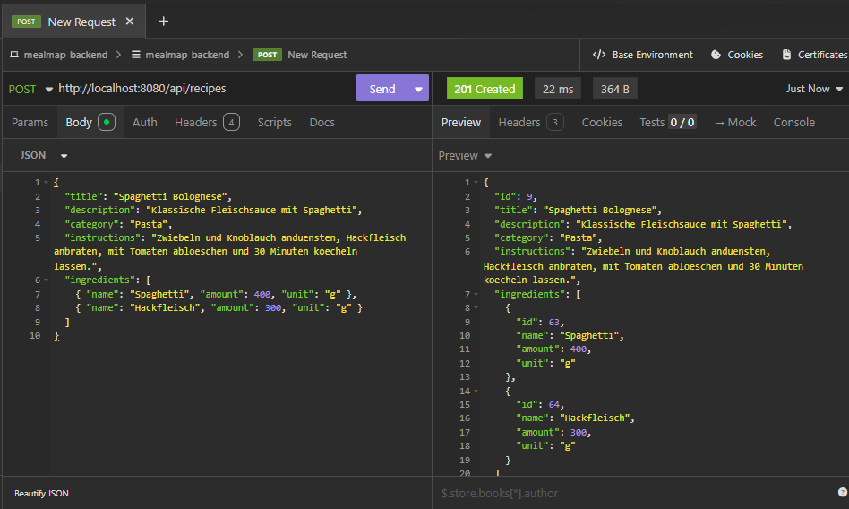

**Testfall 2 — Rezept ohne Titel erstellen (400 Bad Request)**
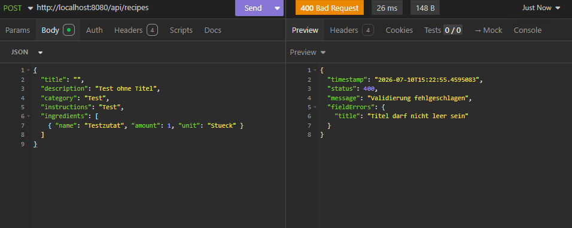

**Testfall 3 — Alle Rezepte abrufen (200 OK)**
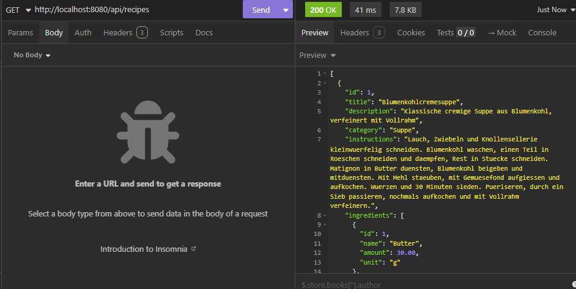

**Testfall 4 — Rezept mit ungültiger ID abrufen (404 Not Found)**
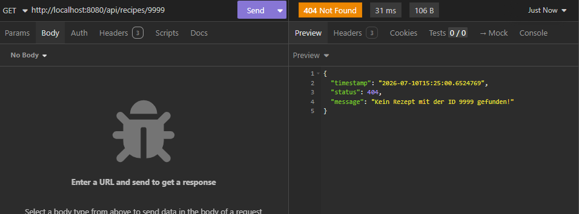

**Testfall 5 — Rezept löschen (204 No Content)**
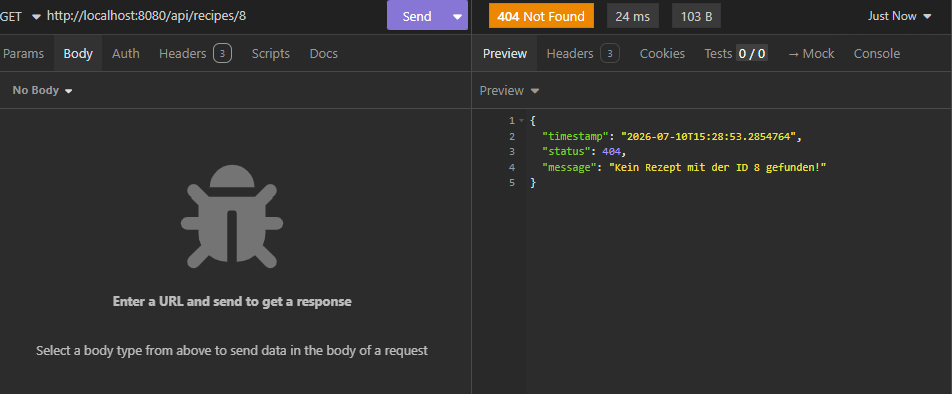

### 4.2 Unit-Tests

Die automatisierten Tests wurden mit JUnit 5, Mockito und AssertJ umgesetzt und decken alle drei im Unterricht behandelten Testarten ab: Repository-Tests (`@DataJpaTest`), Service-Tests (reines Mockito) und Controller-Tests (`@WebMvcTest`). Insgesamt wurden 8 Tests erstellt, verteilt auf 4 Testklassen.

#### Testplan
| # | Testklasse | Testfall | Testart | Was wird geprüft |
|---|---|---|---|---|
| 1 | `RecipeRepositoryTest` | `saveRecipeAlsoSavesIngredients` | `@DataJpaTest` | Beim Speichern eines Rezepts werden die verknüpften Zutaten korrekt mitgespeichert (Cascade, Fremdschlüssel) |
| 2 | `RecipeRepositoryTest` | `findByIdReturnsEmptyForUnknownId` | `@DataJpaTest` | Suche nach nicht existierender ID liefert ein leeres `Optional`, keine Exception |
| 3 | `RecipeSeederTest` | `seederHasDbFilled` | `@SpringBootTest` | Nach App-Start enthält die Datenbank mindestens ein Rezept (Seeder lief erfolgreich) |
| 4 | `RecipeSeederTest` | `recipeCanBeLoaded` | `@SpringBootTest` | Ein vom Seeder angelegtes Rezept (ID 1) kann aus der Datenbank geladen werden |
| 5 | `RecipeServiceMockTest` | `getRecipeByIdThrowsWhenNotFound` | Mockito | Service wirft `RecipeNotFoundException`, wenn das Repository kein Rezept findet |
| 6 | `RecipeServiceMockTest` | `createRecipeSavesAndReturnsDTO` | Mockito | Service mapped Formulardaten korrekt zu einer Entity, speichert sie und gibt das passende DTO zurück |
| 7 | `RecipeControllerTest` | `getByIdReturns200WithBody` | `@WebMvcTest` | GET-Endpoint liefert Status 200 und das korrekte Rezept als JSON |
| 8 | `RecipeControllerTest` | `getByIdReturns404WhenServiceThrows` | `@WebMvcTest` | GET-Endpoint liefert Status 404, wenn der Service eine `RecipeNotFoundException` wirft |

#### Testdurchführung
| # | Testfall | Erwartetes Ergebnis (Soll) | Tatsächliches Ergebnis (Ist) | Status |
|---|---|---|---|---|
| 1 | `saveRecipeAlsoSavesIngredients` | Rezept und Zutat werden gespeichert, Zutat verweist auf das Rezept | Rezept und Zutat erfolgreich gespeichert, Fremdschlüssel korrekt gesetzt | Bestanden |
| 2 | `findByIdReturnsEmptyForUnknownId` | Leeres `Optional` | Leeres `Optional` zurückgegeben | Bestanden |
| 3 | `seederHasDbFilled` | Anzahl Rezepte > 0 | 6 Rezepte in der Datenbank vorhanden | Bestanden |
| 4 | `recipeCanBeLoaded` | Rezept mit ID 1 vorhanden | Rezept mit ID 1 erfolgreich geladen | Bestanden |
| 5 | `getRecipeByIdThrowsWhenNotFound` | `RecipeNotFoundException` wird geworfen | Exception korrekt geworfen | Bestanden |
| 6 | `createRecipeSavesAndReturnsDTO` | DTO mit korrektem Titel und Kategorie | DTO korrekt zurückgegeben, `save()` mit korrekten Werten aufgerufen | Bestanden |
| 7 | `getByIdReturns200WithBody` | Status 200, JSON mit korrektem Titel | Status 200, `title` korrekt im JSON-Body | Bestanden |
| 8 | `getByIdReturns404WhenServiceThrows` | Status 404 | Status 404 zurückgegeben | Bestanden |

**Ergebnis:** Alle 8 Tests wurden erfolgreich ausgeführt (`Process finished with exit code 0` bei jedem Testlauf). Die Anwendung verhält sich in allen getesteten Fällen wie erwartet.

#### Screenshots als Nachweis

**RecipeRepositoryTest — 2 Tests bestanden**
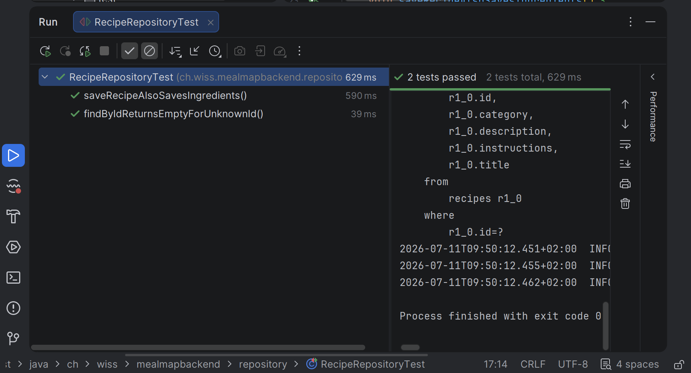

**RecipeSeederTest — 2 Tests bestanden**
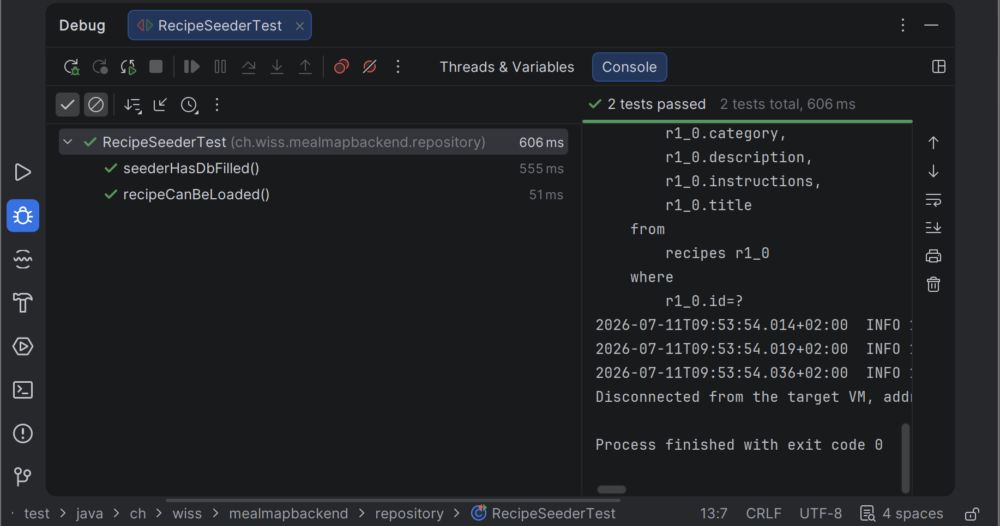

**RecipeServiceMockTest — 2 Tests bestanden**
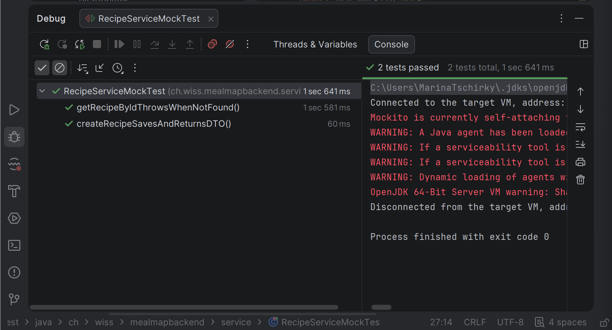

**RecipeControllerTest — 2 Tests bestanden**
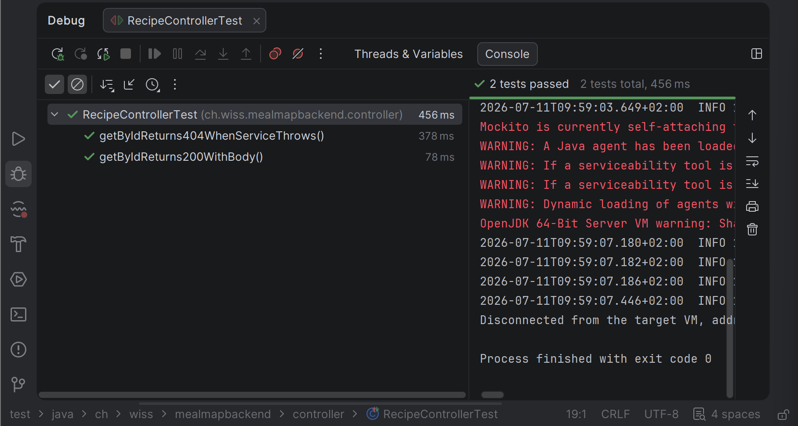

---

## 5. Installationsanleitung - mealmap-backend

### Voraussetzungen

Folgende Software muss lokal installiert sein, bevor mit der Installation begonnen wird:

- **Java 21** (oder höher)
- **Maven** (wird über den mitgelieferten Wrapper `mvnw` / `mvnw.cmd` verwendet, keine separate Installation nötig)
- **Docker Desktop** (für die PostgreSQL-Datenbank)
- **IntelliJ IDEA** (empfohlen, mit Maven-Unterstützung)
- **Git**

### 1. Repository klonen

Terminal (z. B. IntelliJ-Terminal oder PowerShell) im gewünschten Zielordner öffnen und ausführen:

```bash
git clone https://github.com/DomHas/mealmap-backend.git
cd mealmap-backend
```

### 2. Projekt in IntelliJ öffnen

1. IntelliJ IDEA öffnen
2. **File → Open** → den geklonten Ordner `mealmap-backend` auswählen
3. IntelliJ erkennt automatisch die `pom.xml` und importiert das Projekt als Maven-Projekt
4. Falls die Dependencies nicht automatisch aufgelöst werden: Rechtsklick auf `pom.xml` → **Maven → Reload Project**
5. Kontrolle: Es darf kein rotes Kreuz auf dem `pom.xml`-Tab erscheinen

### 3. Datenbank (PostgreSQL) starten

Die Anwendung benötigt eine laufende PostgreSQL-Datenbank, die über Docker bereitgestellt wird.

1. Docker Desktop starten und warten, bis es vollständig hochgefahren ist
2. Im Terminal, im Projekt-Root (gleiche Ebene wie `docker-compose.yml`):

```bash
docker compose up -d
```

3. Kontrolle, ob der Container läuft:

```bash
docker ps
```

Es sollte ein Container `mealmap-postgres` mit Status `Up` erscheinen, gemappt auf Port `5433` (lokal) → `5432` (im Container).

### 4. Konfiguration prüfen

Die Datei `src/main/resources/application.properties` enthält bereits die passenden Zugangsdaten für die Datenbank:

- **Datenbank:** `mealmapdb`
- **User:** `mealmap`
- **Passwort:** `mealmap`
- **Port:** `5433`

Diese Werte müssen mit den Angaben in der `docker-compose.yml` übereinstimmen. Bei Standard-Setup ist keine Anpassung nötig.

### 5. Anwendung starten

**Über IntelliJ:**

Die Klasse `MealmapBackendApplication` öffnen und über den grünen Play-Button links neben der `main`-Methode starten.

**Über das Terminal:**

```bash
./mvnw spring-boot:run
```

Bei erfolgreichem Start erscheinen in der Konsole u. a. folgende Meldungen:

```
HikariPool-1 - Start completed.
Tomcat started on port 8080 (http)
Started MealmapBackendApplication in X seconds
```

Beim allerersten Start befüllt der `RecipeDataSeeder` die Datenbank automatisch mit sechs Beispielrezepten samt Zutaten.

### 6. API testen

Die Anwendung ist danach unter `http://localhost:8080` erreichbar. Beispiel-Endpoint zur Kontrolle:

```
GET http://localhost:8080/api/recipes
```

Dieser sollte eine JSON-Liste mit den geseedeten Rezepten zurückliefern.

### 7. Tests ausführen (optional)

Die Unit-Tests liegen unter `src/test/java`. Sie können einzeln oder gesamt über IntelliJ (Rechtsklick auf den `test`-Ordner → **Run 'All Tests'**) oder über das Terminal ausgeführt werden:

```bash
./mvnw test
```

**Hinweis:** Die Repository- und Seeder-Tests (`@DataJpaTest`, `@SpringBootTest`) benötigen die laufende Docker-Datenbank aus Schritt 3. Die Service- und Controller-Tests (Mockito, `@WebMvcTest`) benötigen keine Datenbankverbindung.

### Fehlerbehebung

| Problem | Lösung |
|---|---|
| `Cannot connect to the Docker daemon` | Docker Desktop starten und warten, bis es vollständig läuft |
| Port `5433` bereits belegt | Anderen Container/Prozess auf diesem Port beenden, oder Port in `docker-compose.yml` und `application.properties` anpassen |
| Rotes Kreuz auf `pom.xml` | Maven-Projekt neu laden (**Maven → Reload Project**) |
| `HikariPool` Verbindungsfehler beim Start | Prüfen, ob der Docker-Container tatsächlich läuft (`docker ps`) |

---

## 6. Hilfestellungen und Quellen
### Mitlernende
Gemeinsame Umsetzung im Team **Dominique Hassenpflug** und **Marina Tschirky** im selben GitHub-Repository (siehe Commit-Historie für die jeweiligen Beiträge).

### Zusammenarbeitsübersicht

Basierend auf der Commit-Historie im GitHub-Repository
(`github.com/DomHas/mealmap-backend`, Branch `main`):

| Datum | Bereich | Autor |
|---|---|---|
| 04.07.2026 | Projekt-Setup mit pom.xml Dependencies | Dominique Hasenpflug |
| 04.07.2026 | Docker-Compose und Datenbank-Verbindung konfiguriert | Dominique Hasenpflug |
| 04.07.2026 | Recipe und Ingredient Entities mit OneToMany/ManyToOne Beziehung | Dominique Hasenpflug |
| 04.07.2026 | Recipe Repository und Seed-Daten mit 6 Rezepten | Dominique Hasenpflug |
| 04.07.2026 | DTOs für Recipe und Ingredient (Ausgabe und Eingabe mit Validierung) | Dominique Hasenpflug |
| 08.07.2026 | Packages für Mapper, Service, Exception angelegt | Marina Tschirky |
| 09.07.2026 | RecipeMapper implementiert, Service und Exception als Gerüst angelegt | Marina Tschirky |
| 09.07.2026 | RecipeNotFoundException implementiert | Marina Tschirky |
| 09.07.2026 | RecipeService vollständig implementiert (CRUD) | Marina Tschirky |
| 09.07.2026 | RecipeController implementiert (CRUD-Endpoints) | Marina Tschirky |
| 09.07.2026 | ErrorResponse DTO hinzugefügt | Marina Tschirky |
| 09.07.2026 | GlobalExceptionHandler implementiert | Marina Tschirky |
| 10.07.2026 | RecipeRepositoryTest hinzugefügt | Marina Tschirky |
| 10.07.2026 | RecipeSeederTest hinzugefügt | Marina Tschirky |
| 10.07.2026 | RecipeServiceMockTest hinzugefügt | Marina Tschirky |
| 10.07.2026 | RecipeControllerTest hinzugefügt | Marina Tschirky |
| 10.07.2026 | Grundgerüst Gesamtdokumentation mit User Stories | Dominique Hasenpflug |
| 10.07.2026 | Klassendiagramm zur Dokumentation hinzugefügt | Marina Tschirky |
| 10.07.2026 | Installationsanleitung ergänzt und Überschriftenhierarchie korrigiert | Marina Tschirky |
| 10.07.2026 | Testplan und Testdurchführung Insomnia-Tests ergänzt, Screenshots der Testfälle | Dominique Hasenpflug |
| 10.07.2026 | Projektidee ergänzt | Dominique Hasenpflug |

**Zusammenfassung:** Dominique Hasenpflug übernahm Projekt-Setup,
Datenmodell (Entities, Repository, Seed-Daten, DTOs) sowie
Projektidee, User Stories und den Insomnia-Testteil der
Dokumentation. Marina Tschirky übernahm Mapper, Service, Controller,
Exception Handling, alle Unit-Tests, das Klassendiagramm und die
Installationsanleitung.
### Internet-Quellen
- **Pauli Rezeptbuch der Küche**:
6 Rezepte (Blumenkohlcremesuppe, Glasierte KArotten, Geschnetzeltes Kalbfleisch Zürcher Art, Kartoffelgratin, Vanillegipfel, Zitronencake) 
wurden als Grundlage für die Seed-Daten in `RecipeDataSeeder`verwendet. 
- der fachliche Aufbau der Domäne (Attribute von Rezept und Zutat, z.B. Name/Menge/Einheit bei der Zutat) orientiert sich am Modul 320 (Java OOP Grundlagen, Klassen
`Kochbuch`, `Rezept`, `Zutat`, `Schritt`), in dem dieselben Rezeptunterlagen bereits als reines Java-Objektmodell (ohne Datenbank) umgesetzt wurden.
- Offizielle Spring-Boot- und Spring-Data-JPA-Dokumentation (docs.spring.io) zur Kl$rung einzelner Annotationen und Konfigurationsdetails. 
- Bereits im Unterricht behandelte Aufgaben und Unterlagen (insbesondere 07A "Eine Eins-zu-viele-Beziehung bauen" sowie das eigene, vorher erstellte Projekt `quizbackend`)
- als strukturelle Vorlage für Package-Aufbau, Entities, DTOs, Mapper, Service, Controller und Exception Handling.

### KI-Nutzung (Claude, Antrhopic)
Claude wurde während der gesamten Entwicklung als Lern- und Unsterstützungswerkzeug eingesetzt, angelehnt an die im Unterricht bereits behandelte Vorlage (07A `quizbacken`).
Konkret wurde Claude für:
- Erklärung von Konzepten (z.B. Owning Side vs. Inverse Side bei `@OneToMany` / `@ManyToOne`, Unterschied zwischen `record`und `class`, Bedeutung einzelner Spring-Annotationen)
- Ableitung von Code-Vorlagen aus der bekannten Unterrichtsstruktur (z.B. Übertragung von `Order`/ `OrderItem`aus 07A auf `Recipe`/ `Ingredient`), die im eigenen Projekt nachvollzogen, 
angepasst und getestet wurden.
- Fehleranalyse bei Build- und Laufzeitfehlern (z.B. falsche Maven-Artifact-IDs, `varchar(255)`-Längenfehler bei `instructions`, Docker-Port-Konflikte).
- Unterstützung beim Aufbau der Projektdokumentation (Struktur, Formulierungshilfe).